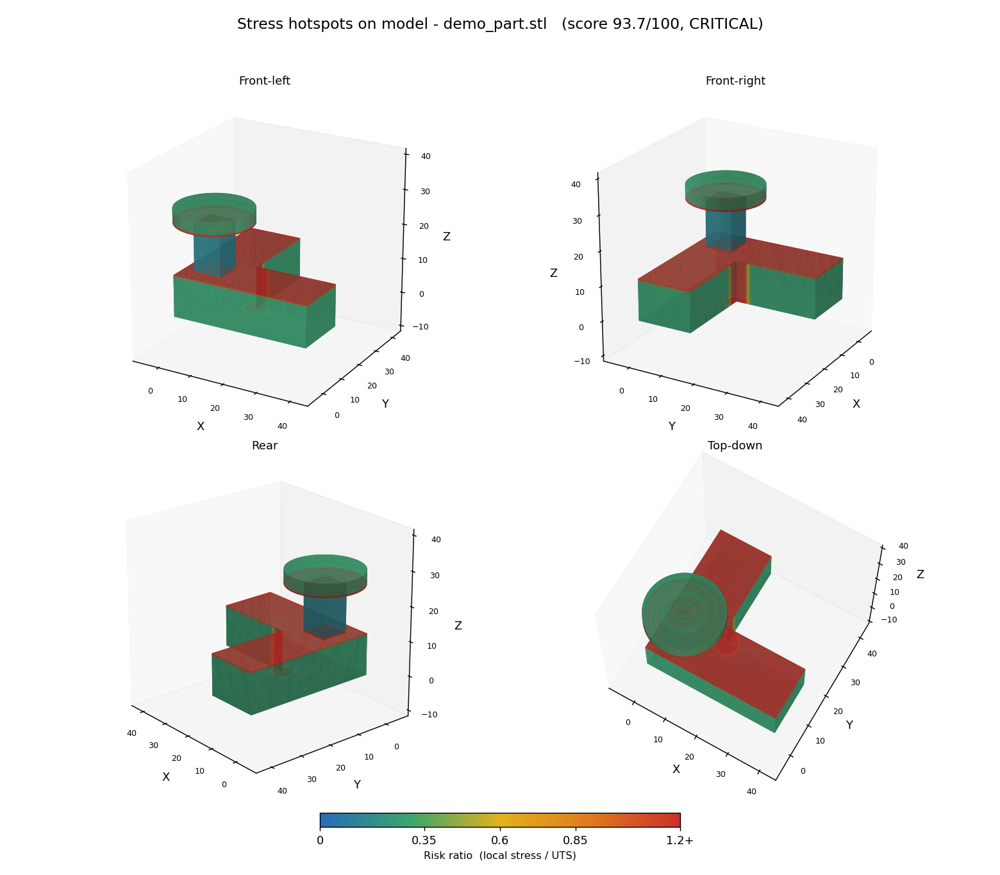
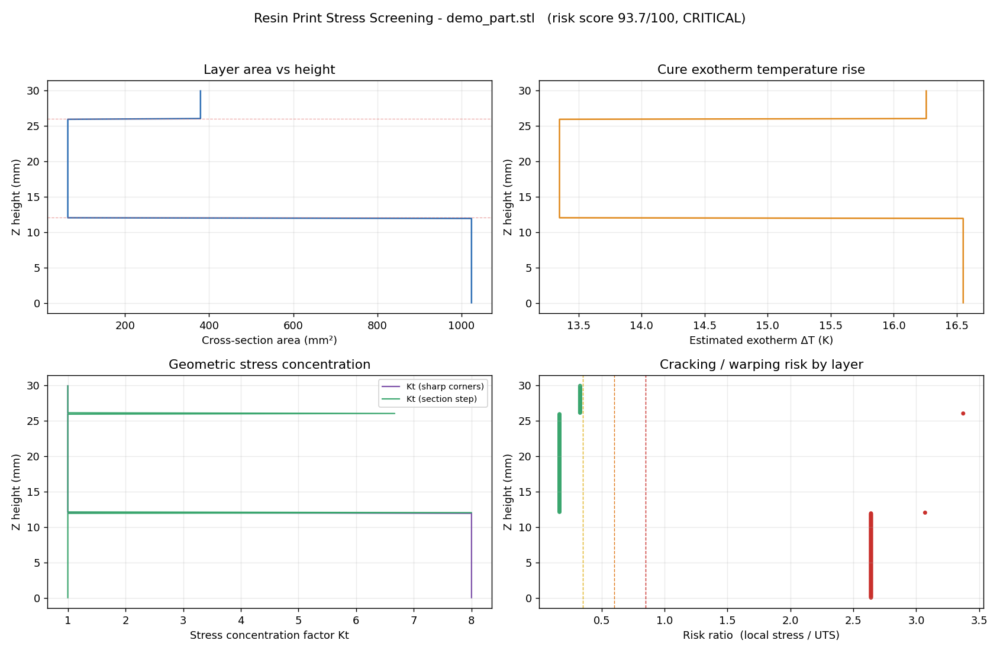

# resin-stress-analyzer

> 光固化（SLA / LCD / DLP）3D 列印的**熱應力與應力集中篩檢工具**
> Stress-concentration screening for resin 3D printing — find the corners that will crack, before you print.

丟一個 STL 進去，它會逐層切片，估算固化放熱造成的溫升、收縮與熱應力，
找出幾何上會把應力放大的**尖銳內凹角**與**截面突變層**，
最後給一份中文報告 + 圖表 + 逐層 CSV。

理論基礎參考 [CHITUBOX：光固化 3D 列印中的熱應力簡述](https://docs.chitubox.com/zh-CN/academy/a-brief-overview-of-thermal-stress-in-resin-3d-printing)。

**應力集中會直接標在模型上**——紅色就是要動刀的地方：





---

## 為什麼需要這個

樹脂在紫外光下交聯是**放熱**反應。厚實區域散熱慢、溫度高，周圍薄壁相對冷，
兩者收縮速率不一致 → 變形受到約束 → 產生熱應力。應力最後會集中在幾何最尖的地方，
於是零件在那裡翹曲、白化、開裂。

切片軟體會告訴你「這裡需要支撐」，但不會告訴你「這個 90 度內凹角會讓局部應力放大 8 倍」。
這個工具補的就是這一段。

---

## 安裝

```bash
git clone https://github.com/<your-account>/resin-stress-analyzer.git
cd resin-stress-analyzer
pip install -r requirements.txt
```

Python 3.10+。或直接 `pip install -e .` 安裝成 `resin-stress` 指令。

## 使用

```bash
# 產生一個故意設計得很糟的示範件
python examples/make_demo_stl.py

# 分析
python -m resin_stress examples/demo_part.stl \
    --material standard --layer-height 0.05 --exposure 2.5 -o report

# 看看有哪些內建材料
python -m resin_stress --list-materials
```

輸出到 `report/`：

| 檔案 | 內容 |
| --- | --- |
| `*_report.md` | 中文報告：總評、熱點清單、改善建議 |
| `*_charts.png` | 四張圖：截面積、溫升、Kt、逐層風險 |
| `*_layers.csv` | 逐層原始數據，可丟進 Excel |
| `*_report.json` | 完整結果，方便串進自己的流程 |
| `*_3d.png` | **四個視角的 3D 熱點圖**，應力集中直接標在模型上 |
| `*_viewer.html` | **互動 3D 檢視**，瀏覽器打開即可旋轉縮放、點熱點看數值 |
| `*_colored.ply` | 帶頂點顏色的網格（加 `--export-mesh ply`），可丟進 MeshLab / Blender |

當程式庫用：

```python
from resin_stress import analyze, PrintSettings

res = analyze("part.stl", material="tough",
              settings=PrintSettings(layer_height=0.05, tilt_deg=35))

print(res.summary["overall_risk_score"], res.summary["overall_level"])
for h in res.hotspots[:3]:
    print(h["x"], h["y"], h["z_min"], "→", h["z_max"], "Kt =", h["kt"])
```

### 常用參數

| 參數 | 說明 | 預設 |
| --- | --- | --- |
| `--material` | 材料（standard / tough / rigid / heat_resistant / dental / flexible / castable） | standard |
| `--layer-height` | 層厚 mm | 0.05 |
| `--pixel-size` | XY 像素尺寸 mm，決定可成形的最小圓角 | 0.035 |
| `--exposure` / `--lift-time` | 單層曝光 / 抬升時間 s，兩者決定單層週期 | 2.5 / 4.0 |
| `--tilt` / `--spin` | 模擬擺放角度（繞 X / 繞 Z） | 0 |
| `--material-file` | 自訂材料 JSON，可覆寫內建參數 | — |
| `--no-3d` | 跳過 3D 熱點圖與互動網頁 | 產生 |
| `--export-mesh` | 另外輸出帶顏色的網格（ply / glb / obj） | — |

---

## 它算了什麼

### 1. 固化放熱溫升

```
q_v = ΔH · DoC · ρ                    單位體積放熱     [J/mm³]
q'' = q_v · h / t_layer               成型面熱通量     [W/mm²]
L_p = 2√(a · t_layer)                 單層熱擴散深度   ≈ 1.5 mm
S   = 1 + L_p / t_eff                 形狀散熱因子
ΔT  = q'' / (h_conv · S)              準穩態溫升（上限為絕熱溫升）
```

其中 `t_eff = 2A/P` 是截面的等效厚度。厚實區 `t_eff ≫ L_p` → `S ≈ 1` → 熱散不掉、溫升最高；
薄壁 `t_eff ≪ L_p` → `S` 大 → 側面散熱、溫升低。典型結果落在 **3 ~ 20 K**。

### 2. 約束程度

「均勻升溫且不受約束並不會產生應力」——真正生成應力的是**溫度不均 + 變形受約束**。
工具用文章列出的三種約束來源估算 0~1 的約束係數：

- **外部約束**：貼平台、支撐 → 基底值 0.20
- **層間約束**：截面突變時新層被舊層卡住 → 由 `|ΔA/A|` 決定
- **內部約束**：厚度遠大於 `L_p` 時內外形成溫度梯度 → 由 `t_eff / L_p` 決定

### 3. 應力

```
σ_th = E · α · ΔT / (1 − ν)                     受約束熱應力
σ_sh = E · ε_shrink · (1 − 鬆弛率) / (1 − ν)     固化收縮應力
```

> 實務上 **固化收縮應力通常大於熱應力**，兩者都會被同一個尖角放大。
> 報告會分別列出，方便判斷該調參數還是該換材料。

### 4. 幾何應力集中 Kt

```
Kt = 1 + 0.5 · f(θ) · √(t / R)        f(θ) = (180° − θ) / 90°
```

`R` 是凹角根部的實際圓角半徑，由「轉角串」演算法從截面輪廓還原：
把連續同向的凹轉頂點視為同一個轉角，`R ≈ 弧長 / 總轉角`，
並在累積轉角超過 90° 時切開——這樣**離散化的圓孔不會被誤判成一圈尖角**。
真正的尖角只有單一頂點、弧長為 0，取列印解析度當下限。

實測還原精度（40 mm L 形件，設定 `--pixel-size 0.035`）：

| 實際圓角 | 還原半徑 | 估算 Kt |
| --- | --- | --- |
| 尖角 | 0.018 | **8.0**（觸頂） |
| R0.5 | 0.499 | 3.24 |
| R1.0 | 0.998 | 2.58 |
| R2.0 | 1.936 | 2.14 |
| R5.0 | 4.843 | 1.72 |

截面突變另外算一個 `Kt_step`：以等面積圓半徑的層間變化量當缺口深度，
**扣掉「自然階梯」高度**——45° 斜面每層剛好前進一個層厚，不該算成應力集中。

### 5. 把結果畫回模型上

每個頂點的風險值取兩者較大：

- **底色**：該高度的「整層都感受得到」的風險（熱應力 + 收縮，經截面突變放大）
- **熱點加成**：距離某條應力集中稜線 3 mm 內的頂點，以高斯衰減套上該熱點的風險值

尖角的 `Kt` 是**局部**效應，若直接拿逐層風險上色會把整個截面都染紅，
所以底色刻意不含它。另外程式會先依模型尺寸細分網格
（STL 的柱子側面常常只有兩個三角形，不細分的話顏色會被內插成一整片），
細分後超過面數上限再簡化回來。

示範件的結果一眼就看得懂：本體是綠色（風險 0.33），
L 形內凹稜線是一條貫穿 12 mm 的紅柱，
z = 12 mm 與 z = 26 mm 的截面突變則是兩圈紅色橫帶，細頸因為散熱好呈藍色。

### 6. 評分

```
risk         = Kt × (σ_th + σ_sh) / UTS       逐層風險比
stress_index = 面積加權的 mean / P90 合成       應力面向
peel_index   = 單層最大截面 / 2000 mm²         剝離力與收縮體積面向
score        = 100 × (1 − e^(−1.2 × index))
```

面積加權是為了避免「球體極點」那種面積極小、變化率極大的過渡層主導整體評分。

| 分數 | 等級 |
| --- | --- |
| < 30 | 低 |
| 30–50 | 中 |
| 50–70 | 高 |
| > 70 | 極高 |

---

## 校驗結果

`tests/` 內含 12 項驗證，確認模型行為符合物理直覺。幾個代表性案例：

| 測試件 | 分數 | 主要驅動 |
| --- | --- | --- |
| 薄板傾斜 35° | 14 低 | 幾何乾淨、截面小 |
| 中空薄殼球（貼平台） | 56 高 | 底部極點是近水平懸空 |
| 實心 40 mm 方塊 | 59 高 | 剝離指數 0.80、溫升 17 K |
| 尖角 L 形 + 突變細頸 | 94 極高 | Kt = 8 的尖角貫穿 12 mm |
| 同上但導 R2 圓角 | 41 中 | **同一顆零件，只改圓角** |

```bash
pytest -q
```

---

## 已知限制

這是**一階估算與排序工具，不是有限元素分析**。請當成「同一顆零件不同版本之間比較」的依據，
不要把 MPa 數字當成可以拿去做結構驗證的絕對值。

具體來說：

- 熱模型是準穩態集總模型，沒有解暫態熱傳導方程
- 應力假設完全約束的線彈性，沒有處理樹脂的黏彈鬆弛與 Tg 附近的行為
- 應力集中只看**水平截面內**的凹角，不分析 Z 方向的稜線曲率
- 只看幾何本身，不模擬支撐結構的實際受力
- 材料參數是文獻典型值，**強烈建議用自家樹脂的 TDS / DSC 數據覆蓋**（`--material-file`）

自訂材料 JSON 範例：

```json
{
  "my_resin": {
    "label": "自家高韌樹脂",
    "alpha": 0.00011, "E": 1900, "nu": 0.36, "uts": 48,
    "cure_shrinkage": 0.009, "enthalpy": 310, "cp": 1.8,
    "density": 1.13, "conductivity": 0.2, "doc": 0.58, "relaxation": 0.55
  }
}
```

---

## 專案結構

```
resin_stress/
├── materials.py   材料熱物性資料庫
├── geometry.py    載入、擺放旋轉、逐層切片
├── thermal.py     放熱溫升、約束程度、熱／收縮應力
├── notch.py       凹角偵測與 Kt 估算
├── analyzer.py    主流程與評分
├── report.py      JSON / CSV / Markdown / 圖表
├── visualize.py   3D 熱點著色、算圖、互動網頁
└── cli.py         命令列介面
```

## 授權

MIT
